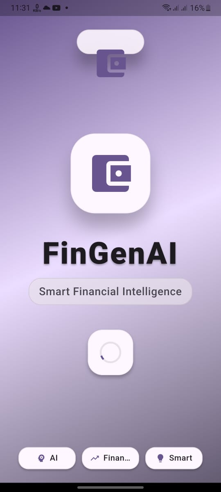
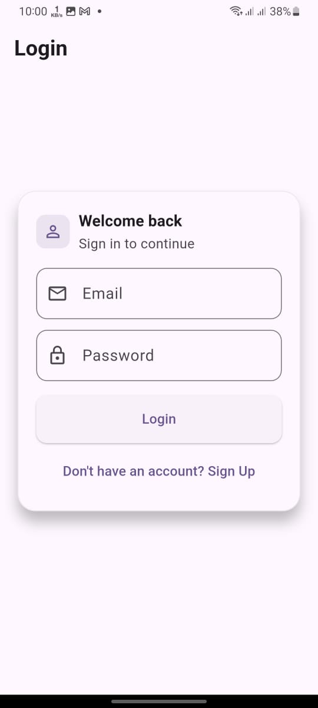
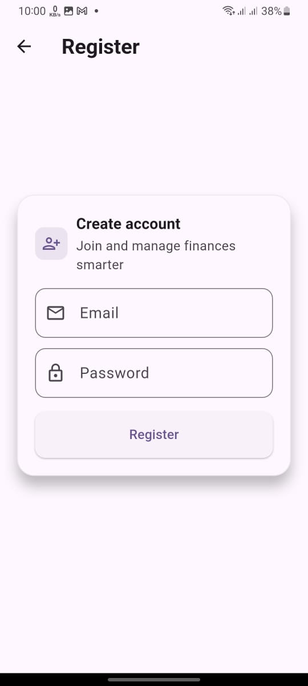
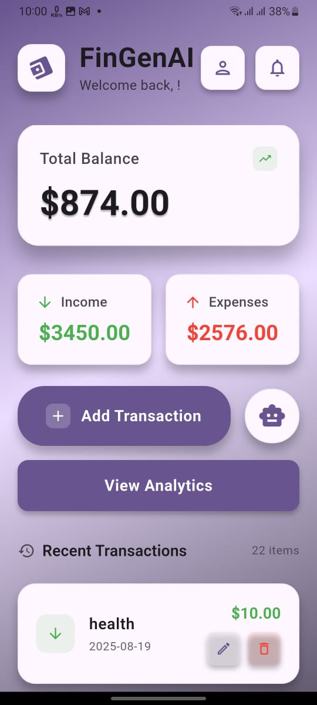
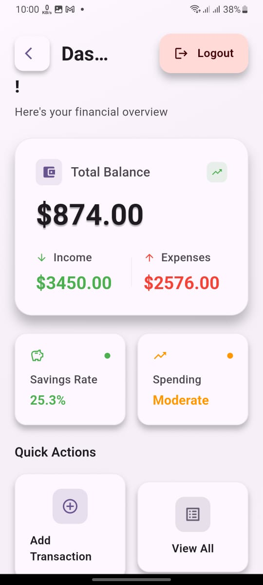
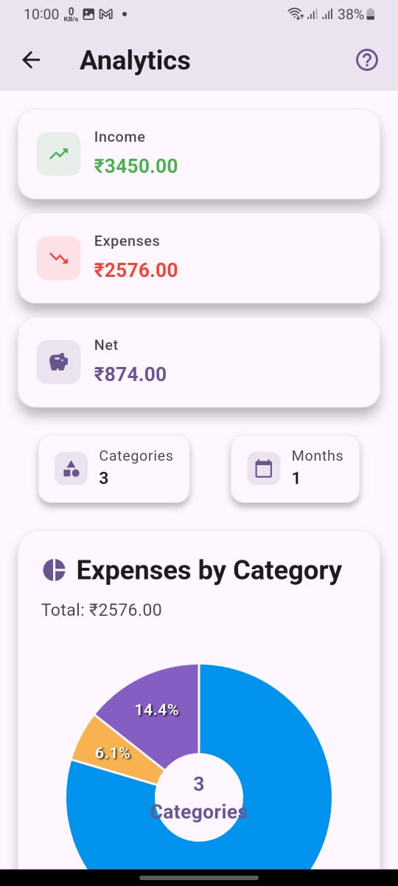

# FinGenAI 💰
A Flutter-based financial tracker app that helps users monitor income, expenses, and balance with insights and charts.

## Features

- 🌟 **Splash Screen** – Welcoming and visually engaging app launch.  
- 🏠 **Home Screen** – Central hub to quickly access all features.  
- 📊 **User Dashboard** – Personalized dashboard showing income, expenses, and financial summary.  
- 📈 **Analytical Insights** – Visual charts and graphs to track spending habits and income trends.  
- 💸 **Transaction Management** – Add, edit, and delete income & expense transactions easily.  
- 🤖 **AI Assistant Chat** – AI-powered assistant to provide financial tips and insights.  
- 📱 **Responsive Design** – Works seamlessly across phones and tablets.  
- ⚡ **Smooth Navigation** – Intuitive interface with smooth transitions between screens.  

## 📱 App Screenshots

| Splash Screen | Login Screen | Registration Screen | Home Screen | User Dashboard |
|---------------|-------------|----------------------|-------------|----------------|
|  |  |  |  |  |

| Analytical Screen | AI Assistant Chat |
|-------------------|-------------------|
|  |  |

## 🛠 Tech Stack

- **Frontend:**   
- **Backend & Auth:**   
- **Database:**   
- **Languages:**   

